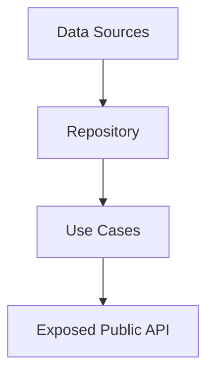

Dependency Injection (DI) is the foundation of Clean Architecture, enabling testability, modularity, and proper separation of concerns.

## Architecture overview

The DI system uses a three-layer approach:

1. **Feature DI containers** - Wire up domain and data layer dependencies
2. **UI DI containers** - Create view and view model instances
3. **Composition root** - Assemble all containers in the app target

## Feature DI containers

Each domain feature has its own DI container that manages the complete dependency graph for that feature.

### Structure

```swift UserDI.swift
public struct UserDI {
    // MARK: - Data Sources
    private let userSession: UserSession
    private let authClient: AuthClient

    // MARK: - Repository
    private let userRepository: UserRepository

    // MARK: - Use Cases
    public let userLoginUseCase: UserLoginUseCase
    public let userIsLoggedInUseCase: UserIsLoggedInUseCase
    public let observeUserIsLoggedInUseCase: ObserveUserIsLoggedInUseCase

    @MainActor
    public init(
        userSession: UserSession = DefaultUserSession(),
        authClient: AuthClient = FakeAuthClient()
    ) {
        self.userSession = userSession
        self.authClient = authClient

        let repository = DefaultUserRepository(
            session: userSession,
            authClient: authClient
        )
        self.userRepository = repository
        
        self.userLoginUseCase = DefaultUserLoginUseCase(
            userRepository: repository
        )
        self.userIsLoggedInUseCase = DefaultUserIsLoggedInUseCase(
            userRepository: repository
        )
        self.observeUserIsLoggedInUseCase = DefaultObserveUserIsLoggedInUseCase(
            userRepository: repository
        )
    }
}
```

<Steps>
  <Step title="Define data sources">
    Private properties hold concrete implementations of data sources and external dependencies.
  </Step>

  <Step title="Create repository">
    Instantiate the repository implementation with its required dependencies.
  </Step>

  <Step title="Expose use cases">
    Public properties expose use cases that UI modules will consume.
  </Step>

  <Step title="Provide default implementations">
    Use default parameter values to simplify production usage while enabling test injection.
  </Step>
</Steps>

### Dependency layers

The container wires dependencies in the correct order:



<Note>
  Notice that only use cases are exposed publicly. Repositories and data sources are implementation details hidden from consumers.
</Note>

## UI DI containers

UI modules have their own DI containers that create views and inject navigation dependencies.

```swift HomeUIDI.swift
public struct HomeUIDI {
    private let navigation: HomeNavigation

    public init(navigation: HomeNavigation) {
        self.navigation = navigation
    }

    @MainActor
    public func mainView() -> some View {
        HomeScreenView(
            viewModel: HomeScreenViewModel(),
            navigation: navigation
        )
    }
    
    @MainActor
    public func detailView(id: UUID) -> some View {
        HomeDetailScreenView(id: id)
    }
}
```

### Responsibilities

<CardGroup cols={2}>
  <Card title="View creation" icon="window">
    Factory methods create view instances with proper dependencies
  </Card>
  <Card title="Navigation injection" icon="route">
    Receives navigation protocol implementation from composition root
  </Card>
  <Card title="Use case wiring" icon="plug">
    Connects view models to domain use cases
  </Card>
  <Card title="Module boundary" icon="border-all">
    Defines the public API surface for the UI module
  </Card>
</CardGroup>

### Complex UI DI example

When a UI module needs domain dependencies:

```swift LoginUIDI.swift
public struct LoginUIDI {
    private let userDI: UserDI
    
    public init(userDI: UserDI) {
        self.userDI = userDI
    }
    
    @MainActor
    public func loginView() -> some View {
        LoginScreenView(
            viewModel: LoginScreenViewModel(
                userLogin: userDI.userLoginUseCase
            )
        )
    }
}
```

The UI DI container receives the feature DI container and extracts only the use cases it needs.

## Composition root

The composition root is the single place where the entire dependency graph is assembled.

```swift Injector.swift
@MainActor
final class Injector {
    static let shared = Injector()
    
    // MARK: - Components
    let userDI: UserDI

    // MARK: - Feature Navigation
    let navigator: Navigator
    
    // MARK: - UI DI Properties
    let loginUIDI: LoginUIDI
    let homeUIDI: HomeUIDI
    let wishlistUIDI: WishlistUIDI
    let cartUIDI: CartUIDI

    private init() {
        // MARK: Navigation
        navigator = Navigator()
        
        // MARK: User Component DI
        userDI = UserDI()

        // MARK: UI Features
        loginUIDI = LoginUIDI(userDI: userDI)
        homeUIDI = HomeUIDI(navigation: navigator)
        wishlistUIDI = WishlistUIDI(navigation: navigator)
        cartUIDI = CartUIDI(navigation: navigator)
    }
}
```

### Design principles

<AccordionGroup>
  <Accordion title="Singleton pattern">
    The Injector uses a singleton to ensure a single dependency graph throughout the app lifetime. This is acceptable because:
    - It's the composition root (entry point of the app)
    - It's only used in the app target, not in modules
    - It's private and controlled
  </Accordion>

  <Accordion title="Initialization order">
    Dependencies are created in the correct order:
    1. Shared infrastructure (Navigator)
    2. Domain containers (UserDI)
    3. UI containers (LoginUIDI, HomeUIDI, etc.)
  </Accordion>

  <Accordion title="@MainActor isolation">
    The Injector is marked `@MainActor` to ensure all view and view model creation happens on the main thread.
  </Accordion>
</AccordionGroup>

## Using the composition root

The Injector is accessed from the app entry point:

```swift Main.swift
@main
struct Main: App {
    @StateObject private var viewModel = MainViewModel(
        observeUserLoggedIn: Injector.shared.userDI.observeUserIsLoggedInUseCase
    )
    
    var body: some Scene {
        WindowGroup {
            ZStack {
                switch viewModel.path {
                case .login:
                    Injector.shared.loginUIDI.loginView()
                case .main:
                    TabScreen(navigator: Injector.shared.navigator)
                }
            }
        }
    }
}
```

<Warning>
  Only access `Injector.shared` from the app target's root views and entry points. Never pass the Injector into modules or features.
</Warning>

## Testing with DI

The DI pattern enables comprehensive testing at every level.

### Testing use cases

```swift UserLoginUseCaseTests.swift
final class UserLoginUseCaseTests: XCTestCase {
    func testLoginWithEmptyUsername() async {
        // Create mock repository
        let mockRepository = MockUserRepository()
        
        // Inject into use case
        let useCase = DefaultUserLoginUseCase(
            userRepository: mockRepository
        )
        
        // Test
        let result = await useCase.execute(
            username: "",
            password: "password"
        )
        
        // Verify
        XCTAssertEqual(result, .failure(.usernameIsEmpty))
    }
}
```

### Testing view models

```swift LoginViewModelTests.swift
final class LoginViewModelTests: XCTestCase {
    @MainActor
    func testLoginSuccess() async {
        // Create mock use case
        let mockLoginUseCase = MockUserLoginUseCase()
        mockLoginUseCase.result = .success(())
        
        // Create view model with mock
        let viewModel = LoginScreenViewModel(
            userLogin: mockLoginUseCase
        )
        
        viewModel.username = "test"
        viewModel.password = "password"
        
        await viewModel.login()
        
        XCTAssertNil(viewModel.error)
        XCTAssertEqual(mockLoginUseCase.capturedUsername, "test")
    }
}
```

### Testing with custom DI configuration

For integration tests, create a test-specific DI configuration:

```swift TestInjector.swift
final class TestInjector {
    static func makeUserDI(
        authClient: AuthClient = MockAuthClient()
    ) -> UserDI {
        return UserDI(
            userSession: InMemoryUserSession(),
            authClient: authClient
        )
    }
}
```

## Module boundaries

The DI system enforces clean module boundaries through Swift Package Manager.

### Feature module structure

```swift Package.swift
let package = Package(
    name: "User",
    products: [
        .library(name: "User", targets: ["User"]),
        .library(name: "UserData", targets: ["UserData"]),
        .library(name: "UserDI", targets: ["UserDI"])
    ],
    targets: [
        .target(
            name: "User",
            path: "Sources",
            exclude: ["DI", "Data"],
            sources: ["Domain"]
        ),
        .target(
            name: "UserData",
            dependencies: ["User"],
            path: "Sources",
            exclude: ["Domain", "DI"],
            sources: ["Data"]
        ),
        .target(
            name: "UserDI",
            dependencies: ["User", "UserData"],
            path: "Sources/DI"
        )
    ]
)
```

This creates three separate products:
- `User` - Domain layer (protocols and models)
- `UserData` - Data layer implementations
- `UserDI` - DI container that wires everything together

<Note>
  Other modules can depend on `User` (domain protocols) without pulling in `UserData` (implementations). This enforces the Dependency Inversion Principle.
</Note>

## Best practices

<CardGroup cols={2}>
  <Card title="Hide implementations" icon="eye-slash">
    Keep repositories and data sources private. Only expose use cases.
  </Card>
  <Card title="Default parameters" icon="sliders">
    Use default parameters for production implementations to simplify usage.
  </Card>
  <Card title="Protocol injection" icon="handshake">
    Inject protocols (abstractions) rather than concrete types whenever possible.
  </Card>
  <Card title="Single responsibility" icon="bullseye">
    Each DI container should manage one feature's dependencies.
  </Card>
  <Card title="No service locator" icon="ban">
    Never pass the Injector into modules. Always inject specific dependencies.
  </Card>
  <Card title="Test seams" icon="flask">
    Design DI containers to make testing easy with parameter injection.
  </Card>
</CardGroup>

## Common patterns

### Shared dependencies

When multiple features need the same dependency:

```swift Injector.swift
private init() {
    // Shared infrastructure
    navigator = Navigator()
    
    // Shared domain components
    userDI = UserDI()
    
    // Features share common dependencies
    homeUIDI = HomeUIDI(navigation: navigator)
    wishlistUIDI = WishlistUIDI(navigation: navigator)
    cartUIDI = CartUIDI(navigation: navigator)
}
```

### Cross-feature dependencies

When one UI feature needs another feature's domain logic:

```swift
loginUIDI = LoginUIDI(userDI: userDI)
```

The LoginUI module depends on the User domain, but not on its data layer implementation.

### Optional dependencies

For features that may not always be available:

```swift
public init(
    analytics: AnalyticsService? = nil
) {
    self.analytics = analytics
}
```
