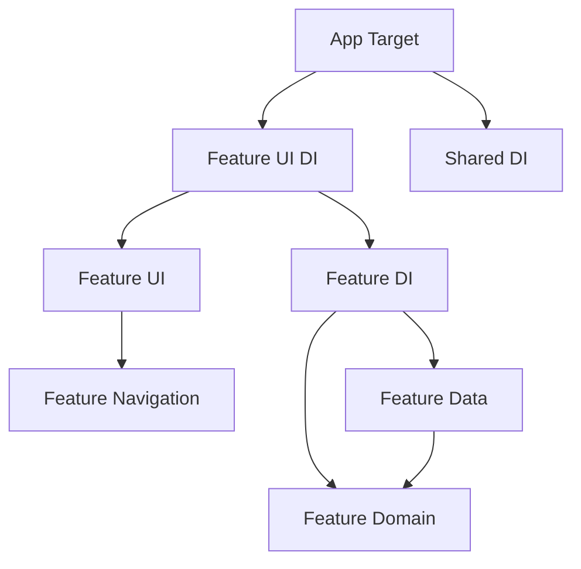
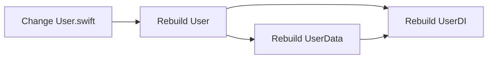

The project uses Swift Package Manager to create modular, independent feature packages that enforce Clean Architecture boundaries.

## Module architecture

The codebase is organized into feature-based Swift packages, each containing multiple products:



## Feature package structure

Each feature follows a consistent package structure with separate products for each layer.

### User feature example

```swift Package.swift
// swift-tools-version: 6.2
import PackageDescription

let package = Package(
    name: "User",
    platforms: [
        .iOS(.v18)
    ],
    products: [
        .library(
            name: "User",
            targets: ["User"]
        ),
        .library(
            name: "UserData",
            targets: ["UserData"]
        ),
        .library(
            name: "UserDI",
            targets: ["UserDI"]
        )
    ],
    targets: [
        .target(
            name: "User",
            dependencies: [],
            path: "Sources",
            exclude: ["DI", "Data"],
            sources: ["Domain"]
        ),
        .target(
            name: "UserData",
            dependencies: ["User"],
            path: "Sources",
            exclude: ["Domain", "DI"],
            sources: ["Data"]
        ),
        .target(
            name: "UserDI",
            dependencies: ["User", "UserData"],
            path: "Sources/DI"
        ),
        .testTarget(
            name: "UserTests",
            dependencies: ["UserDI"],
            path: "Tests/UserTests"
        ),
    ]
)
```

<Steps>
  <Step title="User (Domain)">
    Contains protocols, use cases, and domain models. Has **zero dependencies**.
  </Step>

  <Step title="UserData">
    Contains repository implementations and data sources. Depends only on `User` (domain).
  </Step>

  <Step title="UserDI">
    Wires up domain and data layers. Depends on both `User` and `UserData`.
  </Step>

  <Step title="UserTests">
    Tests depend on `UserDI` to access all implementations for integration tests.
  </Step>
</Steps>

### Directory structure

```
User/
├── Package.swift
├── Sources/
│   ├── Domain/           # → User product
│   │   ├── Model/
│   │   │   ├── User.swift
│   │   │   └── LoginError.swift
│   │   ├── Repository/
│   │   │   └── UserRepository.swift
│   │   └── UseCases/
│   │       ├── UserLoginUseCase.swift
│   │       ├── UserIsLoggedInUseCase.swift
│   │       └── ObserveUserIsLoggedInUseCase.swift
│   ├── Data/             # → UserData product
│   │   ├── DefaultUserRepository.swift
│   │   ├── Session/
│   │   │   └── UserSession.swift
│   │   └── Auth/
│   │       ├── AuthClient.swift
│   │       └── DTO/
│   │           └── AuthToken.swift
│   └── DI/               # → UserDI product
│       └── UserDI.swift
└── Tests/
    └── UserTests/
        └── UserTests.swift
```

<Note>
  Using `exclude` and `sources` in Package.swift allows multiple products to share the same `Sources/` directory while maintaining strict boundaries.
</Note>

## UI feature packages

UI features follow a similar pattern with separate products for UI and DI:

```swift Package.swift
let package = Package(
    name: "HomeUI",
    platforms: [
        .iOS(.v18)
    ],
    products: [
        .library(
            name: "HomeUI",
            targets: ["HomeUI"]
        ),
        .library(
            name: "HomeUIDI",
            targets: ["HomeUIDI"]
        )
    ],
    targets: [
        .target(
            name: "HomeUI",
            dependencies: [],
            path: "Sources",
            exclude: ["DI"],
            sources: ["UI", "Navigation"]
        ),
        .target(
            name: "HomeUIDI",
            dependencies: ["HomeUI"],
            path: "Sources/DI"
        ),
        .testTarget(
            name: "HomeUITests",
            dependencies: ["HomeUIDI"],
            path: "Tests/HomeUITests"
        ),
    ]
)
```

### UI directory structure

```
HomeUI/
├── Package.swift
├── Sources/
│   ├── UI/                      # → HomeUI product
│   │   ├── HomeScreen/
│   │   │   ├── HomeScreenView.swift
│   │   │   └── HomeScreenViewModel.swift
│   │   └── HomeDetails/
│   │       └── HomeDetailScreenView.swift
│   ├── Navigation/              # → HomeUI product
│   │   └── HomeNavigation.swift
│   └── DI/                      # → HomeUIDI product
│       └── HomeUIDI.swift
└── Tests/
    └── HomeUITests/
        └── HomeUITests.swift
```

<CardGroup cols={2}>
  <Card title="HomeUI" icon="mobile">
    Views, view models, and navigation protocols (no dependencies)
  </Card>
  <Card title="HomeUIDI" icon="plug">
    DI container that wires up views with navigation (depends on HomeUI)
  </Card>
</CardGroup>

## Dependency rules

The module structure enforces Clean Architecture dependency rules through Swift Package Manager:

### Domain independence

```swift
.target(
    name: "User",
    dependencies: [],  // Zero dependencies!
    path: "Sources",
    sources: ["Domain"]
)
```

Domain modules have **no dependencies** on other packages. This ensures:
- Business logic is portable and reusable
- Domain can be tested in complete isolation
- No coupling to frameworks or external libraries

### Data depends on domain

```swift
.target(
    name: "UserData",
    dependencies: ["User"],  // Only depends on domain
    path: "Sources",
    sources: ["Data"]
)
```

Data layer implementations depend on domain protocols, not concrete implementations.

### DI composes everything

```swift
.target(
    name: "UserDI",
    dependencies: ["User", "UserData"],  // Composes both layers
    path: "Sources/DI"
)
```

The DI module is the only module that depends on both domain and data layers.

<Warning>
  Never make the domain layer depend on the data layer. This violates the Dependency Inversion Principle.
</Warning>

## Benefits of this structure

### Compile-time enforcement

Swift Package Manager enforces dependency rules at compile time:

```swift
// In UserData module - ✅ Allowed
import User
let repo: UserRepository = DefaultUserRepository()

// In User module - ❌ Compile error
import UserData  // Error: No such module 'UserData'
```

### Incremental compilation

Changes to one module only rebuild dependent modules:



Changing a view doesn't rebuild the entire app.

### Parallel builds

Independent modules can be built in parallel:

```
[HomeUI] Building...
[CartUI] Building...
[WishlistUI] Building...
[User] Building...
```

### Selective testing

Test individual modules without building the entire app:

```bash
# Test only the User module
swift test --package-path User

# Test only HomeUI
swift test --package-path HomeUI
```

## Cross-feature dependencies

Features can depend on other features' domain layers:

```swift
.target(
    name: "LoginUIDI",
    dependencies: [
        "LoginUI",
        .product(name: "UserDI", package: "User")
    ],
    path: "Sources/DI"
)
```

<Steps>
  <Step title="Declare package dependency">
    Add the external package to your Package.swift:

    ```swift
    dependencies: [
        .package(name: "User", path: "../User")
    ]
    ```
  </Step>

  <Step title="Add product dependency">
    Reference the specific product from the external package:

    ```swift
    .target(
        name: "LoginUIDI",
        dependencies: [
            .product(name: "UserDI", package: "User")
        ]
    )
    ```
  </Step>

  <Step title="Import in code">
    Use the product in your source files:

    ```swift
    import UserDI
    
    let userDI = UserDI()
    ```
  </Step>
</Steps>

<Note>
  UI features typically only depend on domain layers (use cases and models), not on data layers or other UI features.
</Note>

## Platform specifications

Specify minimum platform versions at the package level:

```swift Package.swift
let package = Package(
    name: "User",
    platforms: [
        .iOS(.v18)
    ],
    // ...
)
```

All targets in the package inherit this platform requirement.

## Test targets

Test targets depend on the DI module to access all implementations:

```swift
.testTarget(
    name: "UserTests",
    dependencies: ["UserDI"],  // Access to all products
    path: "Tests/UserTests"
)
```

This allows tests to:
- Create real DI containers
- Test integration between layers
- Access both protocols and implementations

## Common patterns

### Shared navigation

Multiple UI features can implement and share navigation protocols:

```swift
// In HomeUI/Sources/Navigation/
public protocol HomeNavigation: AnyObject {
    func openHomeDetail(id: UUID)
    func openWishlistDetail(id: UUID)  // Cross-feature navigation
}

// In WishlistUI/Sources/Navigation/
public protocol WishlistNavigation: AnyObject {
    func openWishlistDetail(id: UUID)
    func openCartDetail(id: UUID)
}
```

The app target's Navigator conforms to all protocols:

```swift Destination.swift
extension Navigator:
    HomeNavigation,
    WishlistNavigation,
    CartNavigation
{
    // Implement all navigation methods
}
```

### Shared models

For truly shared models, create a separate package:

```swift
let package = Package(
    name: "Core",
    products: [
        .library(name: "Core", targets: ["Core"])
    ],
    targets: [
        .target(
            name: "Core",
            dependencies: [],
            path: "Sources"
        )
    ]
)
```

Other packages can depend on Core:

```swift
dependencies: [
    .package(name: "Core", path: "../Core")
],
targets: [
    .target(
        name: "User",
        dependencies: [
            .product(name: "Core", package: "Core")
        ]
    )
]
```

## Best practices

<AccordionGroup>
  <Accordion title="One feature per package">
    Keep packages focused on a single feature domain. Don't create monolithic packages.

    ```
    ✅ User/, Product/, Order/
    ❌ BusinessLogic/, AllFeatures/
    ```
  </Accordion>

  <Accordion title="Separate products for layers">
    Always create separate products for domain, data, and DI:

    ```swift
    products: [
        .library(name: "User", targets: ["User"]),
        .library(name: "UserData", targets: ["UserData"]),
        .library(name: "UserDI", targets: ["UserDI"])
    ]
    ```
  </Accordion>

  <Accordion title="Use path and exclude carefully">
    When sharing a Sources directory, use both `path` and `exclude` to prevent overlaps:

    ```swift
    .target(
        name: "User",
        path: "Sources",
        exclude: ["Data", "DI"],
        sources: ["Domain"]
    )
    ```
  </Accordion>

  <Accordion title="Version Swift tools">
    Always specify the Swift tools version:

    ```swift
    // swift-tools-version: 6.2
    ```

    This ensures consistent builds across environments.
  </Accordion>

  <Accordion title="Document public APIs">
    Add documentation comments to public types and methods:

    ```swift
    /// Handles user authentication and session management.
    public protocol UserRepository {
        /// Authenticates a user with credentials.
        /// - Returns: Success or a specific login error.
        func login(username: String, password: String) async -> Result<Void, LoginError>
    }
    ```
  </Accordion>
</AccordionGroup>

## Migration strategy

If you're refactoring an existing project:

<Steps>
  <Step title="Start with domain">
    Extract domain models and use cases into a separate package first.
  </Step>

  <Step title="Add data layer">
    Move repository implementations to the data product.
  </Step>

  <Step title="Create DI product">
    Extract dependency wiring into the DI product.
  </Step>

  <Step title="Extract UI features">
    Move UI code to feature packages, injecting navigation protocols.
  </Step>

  <Step title="Update app target">
    Update the app target to use the new packages through DI containers.
  </Step>
</Steps>

## Build performance tips

<CardGroup cols={2}>
  <Card title="Keep modules small" icon="compress">
    Smaller modules build faster and enable better parallelization
  </Card>
  <Card title="Minimize dependencies" icon="link-slash">
    Each dependency increases build time and complexity
  </Card>
  <Card title="Use protocols" icon="handshake">
    Protocol dependencies don't trigger rebuilds when implementations change
  </Card>
  <Card title="Avoid circular deps" icon="arrows-spin">
    Circular dependencies prevent parallel builds and cause issues
  </Card>
</CardGroup>
