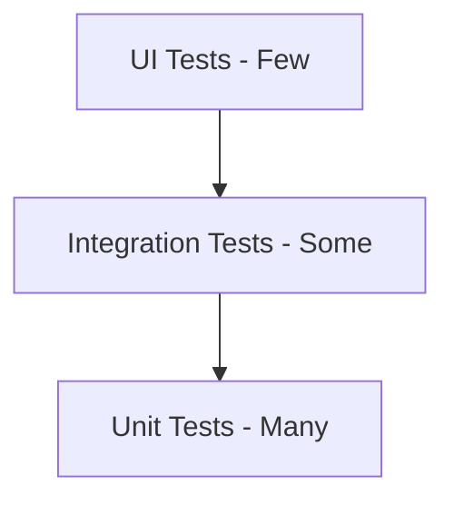

Clean Architecture enables comprehensive testing at every layer through dependency inversion and protocol-based design.

## Testing pyramid

The testing strategy follows the classic testing pyramid:



<CardGroup cols={3}>
  <Card title="Unit tests" icon="cube">
    Fast, isolated tests for use cases and view models
  </Card>
  <Card title="Integration tests" icon="layer-group">
    Test combinations of layers working together
  </Card>
  <Card title="UI tests" icon="mobile">
    End-to-end user flows (minimal, focus on critical paths)
  </Card>
</CardGroup>

## Domain layer testing

Domain layer tests focus on business logic in use cases.

### Testing use cases

Use cases contain business logic and validation rules:

```swift UserLoginUseCaseTests.swift
import XCTest
@testable import User

final class UserLoginUseCaseTests: XCTestCase {
    var mockRepository: MockUserRepository!
    var useCase: DefaultUserLoginUseCase!
    
    override func setUp() {
        super.setUp()
        mockRepository = MockUserRepository()
        useCase = DefaultUserLoginUseCase(
            userRepository: mockRepository
        )
    }
    
    @MainActor
    func testLoginWithEmptyUsername() async {
        // Given
        let username = ""
        let password = "password123"
        
        // When
        let result = await useCase.execute(
            username: username,
            password: password
        )
        
        // Then
        XCTAssertEqual(result, .failure(.usernameIsEmpty))
        XCTAssertEqual(mockRepository.loginCallCount, 0)
    }
    
    @MainActor
    func testLoginWithEmptyPassword() async {
        // Given
        let username = "testuser"
        let password = ""
        
        // When
        let result = await useCase.execute(
            username: username,
            password: password
        )
        
        // Then
        XCTAssertEqual(result, .failure(.passwordIsEmpty))
        XCTAssertEqual(mockRepository.loginCallCount, 0)
    }
    
    @MainActor
    func testLoginWithValidCredentials() async {
        // Given
        let username = "testuser"
        let password = "password123"
        mockRepository.loginResult = .success(())
        
        // When
        let result = await useCase.execute(
            username: username,
            password: password
        )
        
        // Then
        XCTAssertEqual(result, .success(()))
        XCTAssertEqual(mockRepository.loginCallCount, 1)
        XCTAssertEqual(mockRepository.lastUsername, username)
        XCTAssertEqual(mockRepository.lastPassword, password)
    }
}
```

<Steps>
  <Step title="Create mock repository">
    Mock the repository interface to control responses and verify interactions.
  </Step>

  <Step title="Test validation logic">
    Verify business rules like empty field validation before calling the repository.
  </Step>

  <Step title="Test success path">
    Ensure the use case properly delegates to the repository with valid inputs.
  </Step>

  <Step title="Verify interactions">
    Confirm the repository was (or wasn't) called as expected.
  </Step>
</Steps>

### Mock repository implementation

```swift MockUserRepository.swift
import Combine
import User

@MainActor
final class MockUserRepository: UserRepository {
    var loginResult: Result<Void, LoginError> = .success(())
    var loginCallCount = 0
    var lastUsername: String?
    var lastPassword: String?
    
    private let loggedInSubject = CurrentValueSubject<Bool, Never>(false)
    
    var loggedInPublisher: AnyPublisher<Bool, Never> {
        loggedInSubject.eraseToAnyPublisher()
    }
    
    func login(username: String, password: String) async -> Result<Void, LoginError> {
        loginCallCount += 1
        lastUsername = username
        lastPassword = password
        
        if case .success = loginResult {
            loggedInSubject.send(true)
        }
        
        return loginResult
    }
    
    func logout() async {
        loggedInSubject.send(false)
    }
    
    func setLoggedIn(_ value: Bool) {
        loggedInSubject.send(value)
    }
}
```

<Note>
  The mock tracks call counts and captures parameters for verification. It also provides methods to control the mock's behavior.
</Note>

## Data layer testing

Data layer tests verify repository implementations and data mapping.

### Testing repositories

```swift DefaultUserRepositoryTests.swift
import XCTest
import Combine
@testable import UserData
@testable import User

final class DefaultUserRepositoryTests: XCTestCase {
    var mockAuthClient: MockAuthClient!
    var mockSession: MockUserSession!
    var repository: DefaultUserRepository!
    var cancellables: Set<AnyCancellable>!
    
    override func setUp() {
        super.setUp()
        mockAuthClient = MockAuthClient()
        mockSession = MockUserSession()
        repository = DefaultUserRepository(
            session: mockSession,
            authClient: mockAuthClient
        )
        cancellables = []
    }
    
    @MainActor
    func testLoginSuccessUpdatesSession() async {
        // Given
        let user = User(id: UUID(), username: "testuser")
        let token = AuthToken(
            value: "token123",
            expiresAt: Date().addingTimeInterval(3600)
        )
        mockAuthClient.loginResult = .success((user, token))
        
        // When
        let result = await repository.login(
            username: "testuser",
            password: "password"
        )
        
        // Then
        XCTAssertEqual(result, .success(()))
        XCTAssertEqual(mockSession.user, user)
        XCTAssertEqual(mockSession.authToken, token)
    }
    
    @MainActor
    func testLoginFailureDoesNotUpdateSession() async {
        // Given
        mockAuthClient.loginResult = .failure(.invalidCredentials)
        
        // When
        let result = await repository.login(
            username: "testuser",
            password: "wrong"
        )
        
        // Then
        XCTAssertEqual(result, .failure(.invalidCredentials))
        XCTAssertNil(mockSession.user)
        XCTAssertNil(mockSession.authToken)
    }
    
    @MainActor
    func testLoggedInPublisherEmitsChanges() async {
        // Given
        var emittedValues: [Bool] = []
        let expectation = expectation(description: "Publisher emits")
        expectation.expectedFulfillmentCount = 2
        
        repository.loggedInPublisher
            .sink { value in
                emittedValues.append(value)
                expectation.fulfill()
            }
            .store(in: &cancellables)
        
        // When
        mockSession.setLoggedIn(false)
        mockSession.setLoggedIn(true)
        
        // Then
        await fulfillment(of: [expectation], timeout: 1.0)
        XCTAssertEqual(emittedValues, [false, true])
    }
}
```

### Testing data mapping

Test that DTOs are correctly mapped to domain models:

```swift AuthClientTests.swift
@MainActor
func testLoginReturnsCorrectUserAndToken() async {
    // Given
    let authClient = FakeAuthClient()
    
    // When
    let result = await authClient.login(
        username: "testuser",
        password: "password"
    )
    
    // Then
    guard case .success(let (user, token)) = result else {
        XCTFail("Expected success")
        return
    }
    
    XCTAssertEqual(user.username, "testuser")
    XCTAssertFalse(token.value.isEmpty)
    XCTAssertTrue(token.expiresAt > Date())
}
```

## Presentation layer testing

Presentation tests verify view model logic and state management.

### Testing view models

```swift LoginScreenViewModelTests.swift
import XCTest
import Combine
@testable import LoginUI
@testable import User

final class LoginScreenViewModelTests: XCTestCase {
    var mockLoginUseCase: MockUserLoginUseCase!
    var viewModel: LoginScreenViewModel!
    
    @MainActor
    override func setUp() {
        super.setUp()
        mockLoginUseCase = MockUserLoginUseCase()
        viewModel = LoginScreenViewModel(
            userLogin: mockLoginUseCase
        )
    }
    
    @MainActor
    func testLoginSuccessClearsError() async {
        // Given
        viewModel.username = "testuser"
        viewModel.password = "password123"
        mockLoginUseCase.result = .success(())
        
        // When
        await viewModel.login()
        
        // Then
        XCTAssertNil(viewModel.error)
        XCTAssertFalse(viewModel.isLoading)
    }
    
    @MainActor
    func testLoginFailureSetsError() async {
        // Given
        viewModel.username = "testuser"
        viewModel.password = "wrong"
        mockLoginUseCase.result = .failure(.invalidCredentials)
        
        // When
        await viewModel.login()
        
        // Then
        XCTAssertEqual(
            viewModel.error,
            "Invalid username or password."
        )
        XCTAssertFalse(viewModel.isLoading)
    }
    
    @MainActor
    func testLoginSetsLoadingState() async {
        // Given
        viewModel.username = "testuser"
        viewModel.password = "password123"
        mockLoginUseCase.result = .success(())
        mockLoginUseCase.delay = 0.5
        
        // When
        let loginTask = Task {
            await viewModel.login()
        }
        
        // Then - loading is true during execution
        try? await Task.sleep(nanoseconds: 100_000_000)
        XCTAssertTrue(viewModel.isLoading)
        
        // Wait for completion
        await loginTask.value
        XCTAssertFalse(viewModel.isLoading)
    }
    
    @MainActor
    func testErrorMappingForEmptyUsername() async {
        // Given
        viewModel.username = ""
        viewModel.password = "password"
        mockLoginUseCase.result = .failure(.usernameIsEmpty)
        
        // When
        await viewModel.login()
        
        // Then
        XCTAssertEqual(viewModel.error, "Username is required.")
    }
}
```

### Mock use case implementation

```swift MockUserLoginUseCase.swift
import User

final class MockUserLoginUseCase: UserLoginUseCase {
    var result: Result<Void, LoginError> = .success(())
    var capturedUsername: String?
    var capturedPassword: String?
    var executeCallCount = 0
    var delay: TimeInterval = 0
    
    @MainActor
    func execute(username: String, password: String) async -> Result<Void, LoginError> {
        executeCallCount += 1
        capturedUsername = username
        capturedPassword = password
        
        if delay > 0 {
            try? await Task.sleep(nanoseconds: UInt64(delay * 1_000_000_000))
        }
        
        return result
    }
}
```

<Warning>
  Always test view models with `@MainActor` to match their production behavior. Testing off the main thread can hide concurrency issues.
</Warning>

## Navigation testing

Test navigation behavior using mock navigation protocols:

```swift HomeScreenViewModelTests.swift
final class MockHomeNavigation: HomeNavigation {
    var openedHomeDetailId: UUID?
    var openedWishlistDetailId: UUID?
    
    func openHomeDetail(id: UUID) {
        openedHomeDetailId = id
    }
    
    func openWishlistDetail(id: UUID) {
        openedWishlistDetailId = id
    }
}

final class HomeScreenViewModelTests: XCTestCase {
    @MainActor
    func testTappingItemNavigatesToDetail() {
        // Given
        let mockNav = MockHomeNavigation()
        let viewModel = HomeScreenViewModel(navigation: mockNav)
        let itemId = UUID()
        
        // When
        viewModel.didTapItem(id: itemId)
        
        // Then
        XCTAssertEqual(mockNav.openedHomeDetailId, itemId)
    }
    
    @MainActor
    func testAddToWishlistNavigatesToWishlist() {
        // Given
        let mockNav = MockHomeNavigation()
        let viewModel = HomeScreenViewModel(navigation: mockNav)
        let itemId = UUID()
        
        // When
        viewModel.addToWishlist(id: itemId)
        
        // Then
        XCTAssertEqual(mockNav.openedWishlistDetailId, itemId)
    }
}
```

## Integration testing

Integration tests verify multiple layers working together:

```swift UserIntegrationTests.swift
import XCTest
@testable import UserDI
@testable import User

final class UserIntegrationTests: XCTestCase {
    @MainActor
    func testCompleteLoginFlow() async {
        // Given - Use real DI container with fake implementations
        let userDI = UserDI(
            userSession: InMemoryUserSession(),
            authClient: FakeAuthClient()
        )
        
        let loginUseCase = userDI.userLoginUseCase
        let isLoggedInUseCase = userDI.userIsLoggedInUseCase
        
        // When - Execute login
        let loginResult = await loginUseCase.execute(
            username: "testuser",
            password: "password"
        )
        
        // Then - Verify end-to-end behavior
        XCTAssertEqual(loginResult, .success(()))
        XCTAssertTrue(isLoggedInUseCase.execute())
    }
    
    @MainActor
    func testLoginFlowWithObserver() async {
        // Given
        let userDI = UserDI(
            userSession: InMemoryUserSession(),
            authClient: FakeAuthClient()
        )
        
        var isLoggedIn = false
        let cancellable = userDI.observeUserIsLoggedInUseCase
            .execute()
            .sink { isLoggedIn = $0 }
        
        // When
        let result = await userDI.userLoginUseCase.execute(
            username: "testuser",
            password: "password"
        )
        
        // Then
        XCTAssertEqual(result, .success(()))
        
        // Wait for publisher to emit
        try? await Task.sleep(nanoseconds: 100_000_000)
        XCTAssertTrue(isLoggedIn)
        
        cancellable.cancel()
    }
}
```

<Note>
  Integration tests use the real DI container with fake/in-memory implementations instead of mocks. This tests the actual wiring.
</Note>

## Testing best practices

<AccordionGroup>
  <Accordion title="Follow AAA pattern">
    Structure tests with Arrange (Given), Act (When), Assert (Then) for clarity:

    ```swift
    // Given - Set up dependencies and state
    let mock = MockRepository()
    let useCase = UseCase(repository: mock)
    
    // When - Execute the action
    let result = await useCase.execute()
    
    // Then - Verify the outcome
    XCTAssertEqual(result, .success(()))
    ```
  </Accordion>

  <Accordion title="Test one thing per test">
    Each test should verify a single behavior. Don't combine multiple assertions for different scenarios:

    ```swift
    // Good - focused test
    func testLoginWithEmptyUsername() { ... }
    func testLoginWithEmptyPassword() { ... }
    
    // Bad - testing multiple scenarios
    func testLoginValidation() { ... }
    ```
  </Accordion>

  <Accordion title="Use descriptive test names">
    Test names should clearly describe what they test:

    ```swift
    // Good
    func testLoginWithInvalidCredentialsReturnsError()
    func testLogoutClearsUserSession()
    
    // Bad
    func testLogin()
    func test1()
    ```
  </Accordion>

  <Accordion title="Make tests independent">
    Each test should be able to run in isolation without depending on other tests:

    ```swift
    override func setUp() {
        super.setUp()
        // Reset state for each test
        mockRepository = MockUserRepository()
        useCase = DefaultUserLoginUseCase(userRepository: mockRepository)
    }
    ```
  </Accordion>

  <Accordion title="Test error paths">
    Don't just test the happy path. Verify error handling:

    ```swift
    func testLoginWithNetworkErrorHandlesGracefully() async {
        mockAuthClient.loginResult = .failure(.networkFailure)
        let result = await repository.login(...)
        XCTAssertEqual(result, .failure(.unknown))
    }
    ```
  </Accordion>

  <Accordion title="Use async/await properly">
    Mark test methods with `async` and `await` async operations:

    ```swift
    @MainActor
    func testAsyncOperation() async {
        let result = await useCase.execute()
        XCTAssertEqual(result, expected)
    }
    ```
  </Accordion>
</AccordionGroup>

## Code coverage goals

<CardGroup cols={3}>
  <Card title="Domain layer" icon="bullseye">
    Aim for 90%+ coverage on use cases and business logic
  </Card>
  <Card title="Data layer" icon="database">
    Target 80%+ coverage for repositories and data sources
  </Card>
  <Card title="Presentation layer" icon="chart-line">
    Achieve 70%+ coverage for view models and state management
  </Card>
</CardGroup>

<Warning>
  Code coverage is a metric, not a goal. Focus on testing behavior and edge cases rather than chasing 100% coverage.
</Warning>

## Running tests

### Command line

```bash
# Run all tests
swift test

# Run tests for specific package
swift test --package-path User

# Run with coverage
swift test --enable-code-coverage
```

### Xcode

<Steps>
  <Step title="Open test navigator">
    Press `⌘6` to open the test navigator
  </Step>
  
  <Step title="Run tests">
    Click the play button next to a test class or individual test
  </Step>
  
  <Step title="View coverage">
    Enable coverage in scheme settings, then view in the Report Navigator (`⌘9`)
  </Step>
</Steps>
