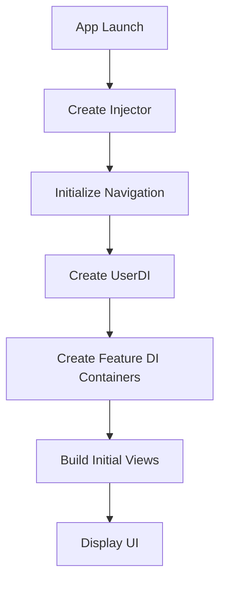

The Application layer is responsible for composing all dependencies and initializing the app. It creates the dependency graph and wires together the Domain, Data, and Presentation layers.

## Architecture overview

The Application layer handles:

- **Dependency Injection**: Creating and providing dependencies to features
- **Composition Root**: Single place where all dependencies are assembled
- **Module DI Containers**: Feature-specific dependency containers
- **App Initialization**: Setting up the initial state and navigation

<Note>
The Application layer is the only place where all layers come together. It depends on all layers to wire them up.
</Note>

## Composition root

The composition root is where the entire dependency graph is created.

### Example: Main Injector

```swift Target/Main/Injector.swift
import SwiftUI
import HomeUIDI
import WishlistUIDI
import CartUIDI
import LoginUIDI
import UserDI

@MainActor
final class Injector {
    static let shared = Injector()
    
    // MARK: - Components
    let userDI: UserDI

    // MARK: - Feature Navigation
    let navigator: Navigator
    
    // MARK: - UIDI Properties
    let loginUIDI: LoginUIDI
    let homeUIDI: HomeUIDI
    let wishlistUIDI: WishlistUIDI
    let cartUIDI: CartUIDI
    
    // MARK: - Views (created once to maintain state)
    let homeView: AnyView
    let wishlistView: AnyView
    let cartView: AnyView

    private init() {
        // MARK: Navigation
        navigator = Navigator()
        
        // MARK: User Component DI
        userDI = UserDI()

        // MARK: UI Features
        loginUIDI = LoginUIDI(userDI: userDI)
        homeUIDI = HomeUIDI(navigation: navigator)
        wishlistUIDI = WishlistUIDI(navigation: navigator)
        cartUIDI = CartUIDI(navigation: navigator)
        
        // MARK: Create views once to maintain state across navigation
        homeView = AnyView(homeUIDI.mainView())
        wishlistView = AnyView(wishlistUIDI.mainView())
        cartView = AnyView(cartUIDI.mainView())
    }
}
```

### Key principles

<Steps>
  <Step title="Single instance">
    Use a singleton or single instance at the app level to ensure one dependency graph.
  </Step>
  
  <Step title="Create dependencies in order">
    Build lower-level dependencies first (data sources, repositories, use cases, then UI).
  </Step>
  
  <Step title="Inject, don't create">
    Pass dependencies to child containers rather than having them create their own.
  </Step>
  
  <Step title="Lifetime management">
    Decide which objects are singletons vs created per-screen.
  </Step>
</Steps>

## Module DI containers

Each feature module has its own DI container that encapsulates its dependencies.

### Domain module DI

```swift User/Sources/DI/UserDI.swift
import Foundation
import User
import UserData

public struct UserDI {
    // MARK: - Data Sources
    private let userSession: UserSession
    private let authClient: AuthClient

    // MARK: - Repository
    private let userRepository: UserRepository

    // MARK: - Use Cases
    public let userLoginUseCase: UserLoginUseCase
    public let userIsLoggedInUseCase: UserIsLoggedInUseCase
    public let observeUserIsLoggedInUseCase: ObserveUserIsLoggedInUseCase

    // MARK: - Initializer

    @MainActor
    public init(
        userSession: UserSession = DefaultUserSession(),
        authClient: AuthClient = FakeAuthClient()
    ) {
        self.userSession = userSession
        self.authClient = authClient

        let repository = DefaultUserRepository(session: userSession, authClient: authClient)
        self.userRepository = repository
        
        self.userLoginUseCase = DefaultUserLoginUseCase(userRepository: repository)
        self.userIsLoggedInUseCase = DefaultUserIsLoggedInUseCase(userRepository: repository)
        self.observeUserIsLoggedInUseCase = DefaultObserveUserIsLoggedInUseCase(userRepository: repository)
    }
}
```

<Note>
The `UserDI` container creates the repository and all use cases, but only exposes the use cases publicly. The repository is an internal implementation detail.
</Note>

### Presentation module DI

```swift LoginUI/Sources/DI/LoginUIDI.swift
import SwiftUI
import LoginUI
import UserDI

public struct LoginUIDI {
    private let userDI: UserDI

    public init(userDI: UserDI) {
        self.userDI = userDI
    }

    @MainActor
    public func makeLoginScreenViewModel() -> LoginScreenViewModel {
        LoginScreenViewModel(userLogin: userDI.userLoginUseCase)
    }
    
    @MainActor
    public func loginView() -> some View {
        LoginScreenView(viewModel: makeLoginScreenViewModel())
    }
}
```

### DI container patterns

<Tabs>
  <Tab title="Default dependencies">
    Provide sensible defaults for dependencies:
    
    ```swift
    public init(
        userSession: UserSession = DefaultUserSession(),
        authClient: AuthClient = FakeAuthClient()
    ) {
        // Use defaults unless overridden
    }
    ```
  </Tab>
  
  <Tab title="Injected dependencies">
    Require dependencies from parent containers:
    
    ```swift
    public struct LoginUIDI {
        private let userDI: UserDI
        
        public init(userDI: UserDI) {
            self.userDI = userDI
        }
    }
    ```
  </Tab>
  
  <Tab title="Factory methods">
    Create fresh instances when needed:
    
    ```swift
    @MainActor
    public func makeLoginScreenViewModel() -> LoginScreenViewModel {
        LoginScreenViewModel(userLogin: userDI.userLoginUseCase)
    }
    ```
  </Tab>
</Tabs>

## Dependency scopes

Manage object lifetimes appropriately:

<CardGroup cols={2}>
  <Card title="Singleton" icon="crown">
    Created once and shared across the app (repositories, use cases, data sources)
  </Card>
  
  <Card title="View lifetime" icon="window-restore">
    Created when view appears, destroyed when view disappears (ViewModels)
  </Card>
  
  <Card title="Shared view state" icon="share-nodes">
    Created once and reused across navigation (tab views)
  </Card>
  
  <Card title="Transient" icon="recycle">
    Created fresh every time it's requested (rarely used)
  </Card>
</CardGroup>

### Example: Shared view state

```swift Target/Main/Injector.swift:31-34
// MARK: - Views (created once to maintain state)
let homeView: AnyView
let wishlistView: AnyView
let cartView: AnyView
```

By creating views once in the composition root, they maintain their state when switching tabs:

```swift Target/Main/Injector.swift:49-52
// MARK: Create views once to maintain state across navigation
homeView = AnyView(homeUIDI.mainView())
wishlistView = AnyView(wishlistUIDI.mainView())
cartView = AnyView(cartUIDI.mainView())
```

## Navigation setup

Centralize navigation coordination:

```swift HomeUI/Sources/DI/HomeUIDI.swift
import SwiftUI
import HomeUI

public struct HomeUIDI {
    private let navigation: HomeNavigation

    public init(navigation: HomeNavigation) {
        self.navigation = navigation
    }

    @MainActor
    public func mainView() -> some View {
        HomeScreenView(
            viewModel: HomeScreenViewModel(),
            navigation: navigation
        )
    }
    
    @MainActor
    public func detailView(id: UUID) -> some View {
        HomeDetailScreenView(id: id)
    }
}
```

<Steps>
  <Step title="Define navigation protocols">
    Create protocol contracts for navigation in feature modules.
  </Step>
  
  <Step title="Implement in app layer">
    The app implements navigation protocols with concrete routing logic.
  </Step>
  
  <Step title="Inject into features">
    Pass navigation implementations to feature DI containers.
  </Step>
</Steps>

## Environment setup

Configure different environments (dev, staging, production):

<CodeGroup>
```swift Development
@MainActor
public init() {
    let authClient = FakeAuthClient() // Use fake for development
    self.userSession = DefaultUserSession()
    self.authClient = authClient
    // ...
}
```

```swift Production
@MainActor
public init() {
    let authClient = NetworkAuthClient( // Use real network client
        baseURL: URL(string: "https://api.example.com")!,
        urlSession: .shared
    )
    self.userSession = DefaultUserSession()
    self.authClient = authClient
    // ...
}
```

```swift Testing
@MainActor
public init(mockSession: UserSession, mockAuthClient: AuthClient) {
    self.userSession = mockSession
    self.authClient = mockAuthClient
    // Inject mocks for testing
}
```
</CodeGroup>

## Initialization flow

The app initialization follows this sequence:



<Steps>
  <Step title="Create composition root">
    Initialize the main `Injector` singleton.
  </Step>
  
  <Step title="Setup infrastructure">
    Create navigation, networking, and core services.
  </Step>
  
  <Step title="Build domain containers">
    Initialize domain-level DI containers (UserDI, etc.).
  </Step>
  
  <Step title="Build presentation containers">
    Initialize UI-level DI containers with domain dependencies.
  </Step>
  
  <Step title="Create initial views">
    Build the initial view hierarchy.
  </Step>
</Steps>

## Testing with DI

Dependency injection makes testing straightforward:

```swift
@Test func testLoginFlow() async {
    // Arrange: Create test dependencies
    let mockSession = MockUserSession()
    let mockAuthClient = MockAuthClient()
    let userDI = UserDI(userSession: mockSession, authClient: mockAuthClient)
    let loginUIDI = LoginUIDI(userDI: userDI)
    
    // Act: Create ViewModel with test dependencies
    let viewModel = loginUIDI.makeLoginScreenViewModel()
    viewModel.username = "testuser"
    viewModel.password = "password"
    await viewModel.login()
    
    // Assert: Verify behavior
    #expect(mockSession.user != nil)
    #expect(viewModel.error == nil)
}
```

<Warning>
Avoid using the production `Injector.shared` in tests. Always create test-specific dependency graphs with mocked dependencies.
</Warning>

## Best practices

<AccordionGroup>
  <Accordion title="Keep composition root minimal">
    The composition root should only wire dependencies, not contain business logic.
  </Accordion>
  
  <Accordion title="Use constructor injection">
    Pass dependencies through initializers rather than property injection or service locators.
  </Accordion>
  
  <Accordion title="One container per module">
    Each feature module should have its own DI container that exposes only what's needed.
  </Accordion>
  
  <Accordion title="Default to singletons">
    Most dependencies (repositories, use cases) should be singletons for consistency.
  </Accordion>
  
  <Accordion title="Make dependencies explicit">
    Don't hide dependencies in global state or singletons within modules.
  </Accordion>
  
  <Accordion title="Avoid circular dependencies">
    If you encounter circular dependencies, your layer boundaries may need refactoring.
  </Accordion>
</AccordionGroup>

## Common patterns

<CardGroup cols={2}>
  <Card title="Feature containers" icon="box">
    Each feature has its own DI container with public factory methods
  </Card>
  
  <Card title="Shared state" icon="share">
    Views that need to maintain state are created once in the composition root
  </Card>
  
  <Card title="Protocol injection" icon="plug">
    Inject protocols rather than concrete types for flexibility
  </Card>
  
  <Card title="Environment configuration" icon="gear">
    Use different configurations for dev, staging, and production
  </Card>
</CardGroup>

## SwiftUI integration

Provide dependencies to SwiftUI views:

```swift
@main
struct MyApp: App {
    @MainActor
    private let injector = Injector.shared
    
    var body: some Scene {
        WindowGroup {
            if injector.isLoggedIn {
                TabView {
                    injector.homeView
                        .tabItem { Label("Home", systemImage: "house") }
                    injector.wishlistView
                        .tabItem { Label("Wishlist", systemImage: "heart") }
                    injector.cartView
                        .tabItem { Label("Cart", systemImage: "cart") }
                }
            } else {
                injector.loginUIDI.loginView()
            }
        }
    }
}
```

<Note>
By centralizing dependency creation, you ensure a single source of truth for the entire app's object graph.
</Note>
