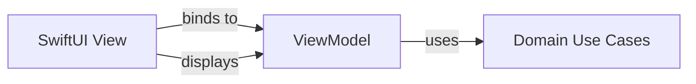

The Presentation layer handles all UI-related logic using the MVVM (Model-View-ViewModel) pattern. It connects user interactions to Domain use cases and presents data in a format suitable for the view.

## Architecture overview

The Presentation layer consists of:

- **ViewModels**: Presentation logic and state management
- **Views**: SwiftUI views that render UI and handle user input
- **Navigation**: Coordination between different screens

<Note>
The Presentation layer depends on the Domain layer but should never import the Data layer directly.
</Note>

## MVVM pattern

The MVVM pattern separates concerns between view logic and UI rendering.



<Steps>
  <Step title="View observes ViewModel">
    SwiftUI views observe `@Published` properties in the ViewModel.
  </Step>
  
  <Step title="ViewModel executes use cases">
    User actions trigger ViewModel methods that execute Domain use cases.
  </Step>
  
  <Step title="ViewModel updates state">
    Results from use cases update `@Published` properties, triggering view updates.
  </Step>
</Steps>

## ViewModels

ViewModels manage presentation state and coordinate with Domain use cases.

### Example: Login ViewModel

```swift LoginUI/Sources/UI/LoginScreen/LoginScreenViewModel.swift
import Foundation
import Combine
import User

@MainActor
public final class LoginScreenViewModel: ObservableObject {
    private let userLogin: UserLoginUseCase

    @Published var username: String = ""
    @Published var password: String = ""
    @Published var isLoading: Bool = false
    @Published var error: String?

    public init(userLogin: UserLoginUseCase) {
        self.userLogin = userLogin
    }

    func login() async {
        isLoading = true
        defer { isLoading = false }
        error = nil

        let result = await userLogin.execute(username: username, password: password)
        switch result {
        case .success:
            break
        case .failure(let loginError):
            self.error = mapLoginErrorToMessage(loginError)
        }
    }

    private func mapLoginErrorToMessage(_ error: LoginError) -> String {
        switch error {
        case .usernameIsEmpty:
            return "Username is required."
        case .passwordIsEmpty:
            return "Password is required."
        case .invalidCredentials:
            return "Invalid username or password."
        case .unknown:
            return "An unknown error occurred. Please try again later."
        }
    }
}
```

### ViewModel characteristics

<CardGroup cols={2}>
  <Card title="MainActor isolation" icon="lock">
    Use `@MainActor` to ensure all UI updates happen on the main thread
  </Card>
  
  <Card title="ObservableObject" icon="eye">
    Conform to `ObservableObject` for SwiftUI integration
  </Card>
  
  <Card title="Published properties" icon="broadcast-tower">
    Use `@Published` for properties that trigger view updates
  </Card>
  
  <Card title="Use case dependencies" icon="plug">
    Inject Domain use cases through the initializer
  </Card>
</CardGroup>

### State management patterns

<Tabs>
  <Tab title="Loading state">
    Track async operations with boolean flags:
    
    ```swift
    @Published var isLoading: Bool = false
    
    func login() async {
        isLoading = true
        defer { isLoading = false }
        
        let result = await userLogin.execute(username: username, password: password)
        // Handle result
    }
    ```
  </Tab>
  
  <Tab title="Error state">
    Store user-friendly error messages:
    
    ```swift
    @Published var error: String?
    
    func login() async {
        error = nil // Clear previous errors
        
        let result = await userLogin.execute(username: username, password: password)
        switch result {
        case .success:
            break
        case .failure(let loginError):
            self.error = mapLoginErrorToMessage(loginError)
        }
    }
    ```
  </Tab>
  
  <Tab title="Input state">
    Bind form inputs to published properties:
    
    ```swift
    @Published var username: String = ""
    @Published var password: String = ""
    
    // SwiftUI automatically updates these when user types
    ```
  </Tab>
</Tabs>

## Views

SwiftUI views render the UI and bind to ViewModel state.

### Example: Login View

```swift LoginUI/Sources/UI/LoginScreen/LoginScreenView.swift
import SwiftUI

public struct LoginScreenView: View {
    @ObservedObject var viewModel: LoginScreenViewModel

    public init(viewModel: LoginScreenViewModel) {
        self.viewModel = viewModel
    }

    public var body: some View {
        VStack(spacing: 20) {
            TextField("Username", text: $viewModel.username)
                .textInputAutocapitalization(.never)
                .autocorrectionDisabled(true)
            SecureField("Password", text: $viewModel.password)
            if viewModel.isLoading {
                ProgressView()
            } else {
                Button("Login") {
                    Task {
                        await viewModel.login()
                    }
                }
            }
            if let error = viewModel.error {
                Text(error).foregroundColor(.red)
            }
        }
        .padding()
    }
}
```

### View patterns

<Steps>
  <Step title="Observe the ViewModel">
    Use `@ObservedObject` to observe ViewModel changes.
  </Step>
  
  <Step title="Bind to published properties">
    Use two-way bindings (`$viewModel.property`) for form inputs.
  </Step>
  
  <Step title="Handle async actions">
    Wrap async ViewModel methods in `Task { await ... }`.
  </Step>
  
  <Step title="Render state conditionally">
    Show different UI based on loading/error/success states.
  </Step>
</Steps>

## Error presentation

Map domain errors to user-friendly messages in the ViewModel:

```swift LoginUI/Sources/UI/LoginScreen/LoginScreenViewModel.swift:39-50
private func mapLoginErrorToMessage(_ error: LoginError) -> String {
    switch error {
    case .usernameIsEmpty:
        return "Username is required."
    case .passwordIsEmpty:
        return "Password is required."
    case .invalidCredentials:
        return "Invalid username or password."
    case .unknown:
        return "An unknown error occurred. Please try again later."
    }
}
```

<Warning>
Never expose domain error types directly to views. Always map them to user-friendly strings in the ViewModel.
</Warning>

## Navigation

Navigation is handled through protocol-based navigation contracts.

### Navigation protocol

```swift HomeUI/Sources/Navigation/HomeNavigation.swift
public protocol HomeNavigation {
    func navigateToHomeDetail(id: UUID)
    func navigateToWishlist(id: UUID)
}
```

### Injecting navigation

```swift HomeUI/Sources/UI/HomeScreen/HomeScreenView.swift
public struct HomeScreenView: View {
    @ObservedObject var viewModel: HomeScreenViewModel
    private let navigation: HomeNavigation
    
    public init(viewModel: HomeScreenViewModel, navigation: HomeNavigation) {
        self.viewModel = viewModel
        self.navigation = navigation
    }
    
    var body: some View {
        Button("View Details") {
            navigation.navigateToHomeDetail(id: itemId)
        }
    }
}
```

<Note>
By using protocols for navigation, views remain testable and don't depend on concrete navigation implementations.
</Note>

## Async operations

Handle asynchronous operations using Swift's async/await:

<CodeGroup>
```swift Button action
Button("Login") {
    Task {
        await viewModel.login()
    }
}
```

```swift ViewModel method
func login() async {
    isLoading = true
    defer { isLoading = false }
    
    let result = await userLogin.execute(username: username, password: password)
    // Process result
}
```

```swift With error handling
func loadData() async {
    isLoading = true
    error = nil
    
    do {
        let data = try await dataUseCase.execute()
        self.items = data
    } catch {
        self.error = "Failed to load data"
    }
    
    isLoading = false
}
```
</CodeGroup>

## Reactive updates with Combine

Subscribe to domain publishers for real-time updates:

```swift
@MainActor
public final class MainViewModel: ObservableObject {
    @Published var isLoggedIn: Bool = false
    private var cancellables = Set<AnyCancellable>()
    
    public init(observeUserIsLoggedIn: ObserveUserIsLoggedInUseCase) {
        observeUserIsLoggedIn.publisher
            .receive(on: DispatchQueue.main)
            .assign(to: &$isLoggedIn)
    }
}
```

<Steps>
  <Step title="Create a cancellables set">
    Store subscriptions to prevent deallocation.
  </Step>
  
  <Step title="Subscribe to publisher">
    Use `assign(to:)` to update `@Published` properties automatically.
  </Step>
  
  <Step title="Ensure main thread">
    Use `receive(on: DispatchQueue.main)` for UI updates.
  </Step>
</Steps>

## Testing ViewModels

ViewModels are highly testable when dependencies are injected:

```swift
@Test func testLoginWithValidCredentials() async {
    // Arrange
    let mockUseCase = MockUserLoginUseCase()
    mockUseCase.result = .success(())
    let viewModel = LoginScreenViewModel(userLogin: mockUseCase)
    
    // Act
    viewModel.username = "testuser"
    viewModel.password = "password123"
    await viewModel.login()
    
    // Assert
    #expect(viewModel.error == nil)
    #expect(viewModel.isLoading == false)
}

@Test func testLoginWithEmptyUsername() async {
    let mockUseCase = MockUserLoginUseCase()
    mockUseCase.result = .failure(.usernameIsEmpty)
    let viewModel = LoginScreenViewModel(userLogin: mockUseCase)
    
    viewModel.username = ""
    viewModel.password = "password123"
    await viewModel.login()
    
    #expect(viewModel.error == "Username is required.")
}
```

## Best practices

<AccordionGroup>
  <Accordion title="Keep views dumb">
    Views should only render state and forward actions to the ViewModel. No business logic in views.
  </Accordion>
  
  <Accordion title="Use @MainActor for ViewModels">
    Always mark ViewModels with `@MainActor` to ensure thread-safe UI updates.
  </Accordion>
  
  <Accordion title="Inject dependencies">
    Pass use cases and navigation through initializers, not global singletons.
  </Accordion>
  
  <Accordion title="Map domain errors">
    Convert domain errors to user-friendly messages in the ViewModel, not the View.
  </Accordion>
  
  <Accordion title="Use protocols for navigation">
    Define navigation contracts as protocols to keep views testable.
  </Accordion>
  
  <Accordion title="Handle loading states">
    Always show loading indicators during async operations for better UX.
  </Accordion>
</AccordionGroup>

## Common patterns

<CardGroup cols={2}>
  <Card title="Form handling" icon="file-lines">
    Bind form inputs to `@Published` properties with two-way bindings
  </Card>
  
  <Card title="State machines" icon="diagram-project">
    Use enums to model complex UI states (loading, success, error)
  </Card>
  
  <Card title="Debouncing" icon="clock">
    Use Combine operators to debounce search inputs
  </Card>
  
  <Card title="Pagination" icon="list">
    Track page state in ViewModel and load more as user scrolls
  </Card>
</CardGroup>
